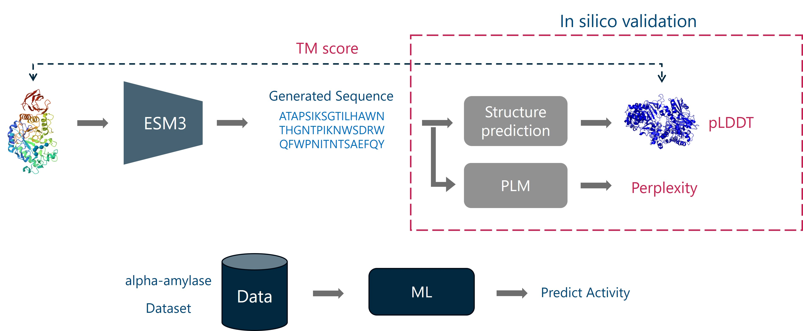

# Protein-Design

### Description

This repo gives you the workflow for designing new alpha-amylase variants with improved activity.
We use the structure of alpha-amylase from PDB ID [1BAG](https://www.rcsb.org/structure/1BAG) and 
use [ESM3](https://github.com/evolutionaryscale/esm) to generate candidate designs for further evaluation.
We also build an ML model to predict alpha-amylase activity from the amino acid sequences to score our designs.

The overall workflow is as below

----

### Details about the Repo

#### <ins>Initial Analysis</ins>

A preliminary analysis was conducted on the given dataset (Data/sequences.csv). 
Some sequences were found to be different from alpha-amylases so they were removed.

[notebook: load_and_analyse.ipynb](src/notebooks/load_and_analyse.ipynb) - we create fasta files and eliminate suspicious sequences.

[notebook: validate_input_sequences.ipynb](src/notebooks/validate_input_sequences.ipynb) - here we see if the suspicious sequences are not alpha-amylases. We do this using hmm profiles for the domains in alpha-amylases and using hmmsearch on the suspected sequences.

#### <ins>Using ESM3</ins>

Here we are adding esm3 as a gitmodule instead of installing (you can also install esm3)
use script [esm3](src/scripts/generate_esm3.py)

#### <ins>Generating Structures and Calculating perplexity</ins>

We use ESMFOLD to predict structures from sequences [src/scripts/esmfold.py](src/scripts/esmfold.py)
We use ESM2 LM to compute perplexity [src/scripts/compute_perplexity.py](src/scripts/compute_perplexity.py)

#### <ins>Evaluating Generations</ins>

We build an RF model on top of ESM2 embeddings to predict activity [refer: surrogate.ipynb]((src/notebooks/surrogate_model.ipynb))
